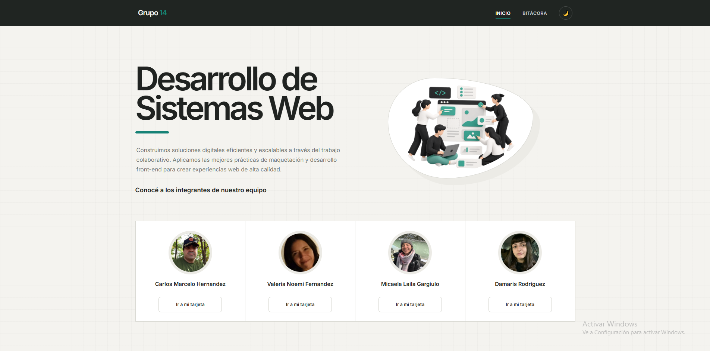
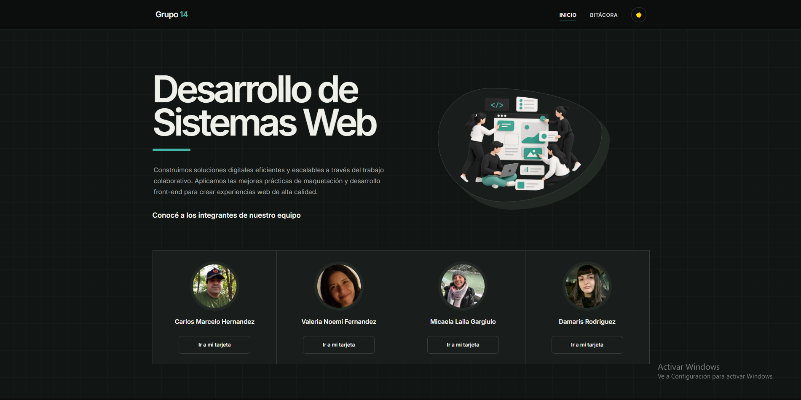
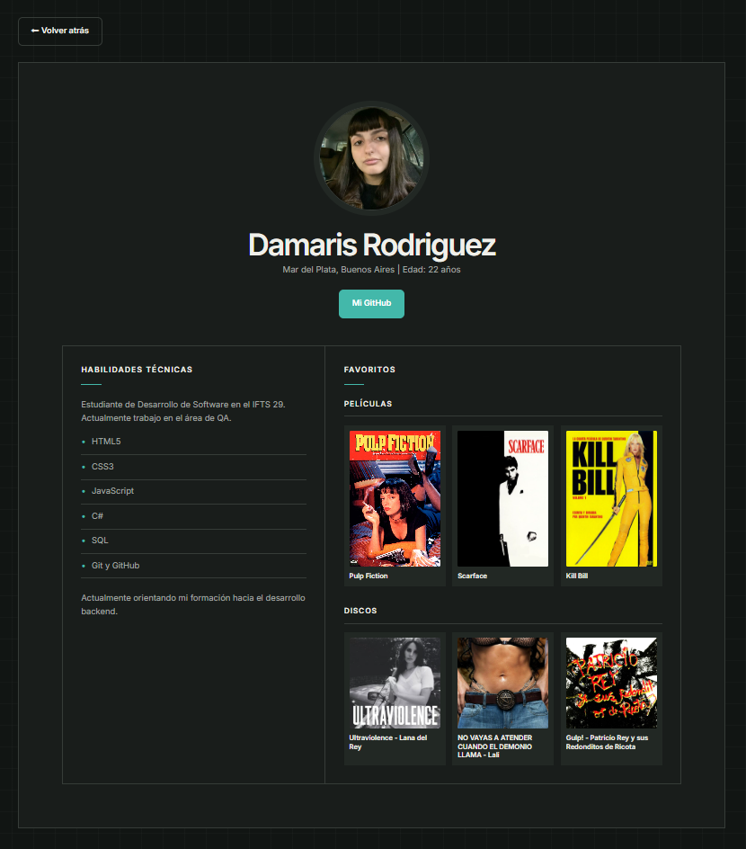
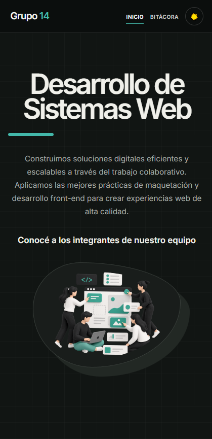

# TP1 — Desarrollo de Sistemas Web | Grupo 14

**Materia:** Frontend — IFTS 29  
**Cuatrimestre:** 2do Cuatrimestre 2026  
**Comisión:** Grupo 14

> Sitio web colaborativo tipo portfolio/equipo con diseño moderno, responsive y modo oscuro persistente.

🔗 **Sitio web publicado:** [Ver en Vercel](https://tp1-front-ifts29-grupo-14.vercel.app/)

---

## 👥 Integrantes del Equipo

| Integrante | Perfil individual |
|---|---|
| Carlos Marcelo Hernandez | [`carlos.html`](carlos.html) |
| Valeria Noemi Fernandez | [`valeria.html`](valeria.html) |
| Micaela Laila Gargiulo | [`micaela.html`](micaela.html) |
| Dámaris Rodriguez | [`damaris.html`](damaris.html) |

---

## 📄 Descripción del Proyecto

El sitio consiste en una **página principal** (`index.html`) que presenta al equipo mediante una sección hero y una grilla de tarjetas con foto y enlace a cada perfil individual. Cada integrante tiene su propia **tarjeta de perfil** (archivo `.html` en la raíz) con información personal, habilidades técnicas y contenido multimedia favorito (películas y discos). Además, el sitio cuenta con una **bitácora de desarrollo** (`bitacora.html`) que documenta las decisiones, dificultades y soluciones aplicadas durante el proceso.

### Dinámica de Trabajo en Equipo

- **Encuentros virtuales:** Realizamos múltiples sesiones de trabajo por Google Meet compartiendo pantalla para debatir decisiones de diseño y resolver bloqueos técnicos en tiempo real.
- **Roles y aportes:** Dividimos las tareas de manera equitativa. Mientras algunos optimizaban la estructura base de navegación y los estilos, otros diseñaban las secciones de perfiles individuales y recopilaban los recursos multimedia.
- **Control de versiones:** Usamos **Git y GitHub** como repositorio central. Cada integrante clonó el proyecto localmente, desarrolló su tarjeta de perfil y realizó sus respectivos _commits_ de forma sincronizada.

---

## 🛠️ Tecnologías Utilizadas

| Tecnología | Uso en el proyecto |
|---|---|
| **HTML5** | Estructura semántica de todas las páginas (`<header>`, `<main>`, `<nav>`, `<section>`, `<footer>`) |
| **CSS3** | Estilos visuales, layout con Grid y Flexbox, variables CSS (custom properties), animaciones y transiciones |
| **JavaScript** | Lógica de interactividad: modo oscuro persistente con `localStorage` |
| **Google Fonts** | Tipografía _Inter_ (pesos 300, 400 y 600) importada desde CDN |
| **Git / GitHub** | Control de versiones y trabajo colaborativo |
| **Vercel** | Hosting y deploy del sitio |

---

## 🎨 Estilos y Decisiones de Diseño

### Paleta de colores

El sitio utiliza **CSS Custom Properties** (`:root`) para manejar dos paletas completas (clara y oscura) de forma centralizada:

| Variable | Modo Claro | Modo Oscuro | Uso |
|---|---|---|---|
| `--bg` | `#f4f3ef` | `#111513` | Fondo general |
| `--surface` | `#ffffff` | `#191d1b` | Tarjetas y contenedores |
| `--surface-2` | `#ecebe6` | `#222824` | Fondos secundarios |
| `--text` | `#202321` | `#f0f0ea` | Texto principal |
| `--muted` | `#70746f` | `#a5aaa6` | Texto secundario |
| `--accent` | `#168276` | `#43b8aa` | Acentos (verde azulado / teal) |
| `--nav` | `#202522` | `#0b0e0d` | Fondo del navbar y footer |

### Layout y Responsive

Se utilizó **CSS Grid** como sistema de layout principal:

- **Portada hero:** grilla de dos columnas (`1.1fr 0.9fr`) que colapsa a una sola columna en pantallas menores a 900px.
- **Grilla de equipo:** `repeat(4, 1fr)` → `repeat(2, 1fr)` en ≤1200px → `1fr` en ≤600px.
- **Perfil detallado:** grilla de dos columnas (`.85fr 1.15fr`) que se lineariza en ≤900px.
- **Bitácora:** grilla de dos columnas (sidebar + contenido) que se apila en ≤600px.

**Breakpoints definidos:** `400px`, `600px`, `900px`, `1200px` + soporte para `prefers-reduced-motion`.

### Tipografía

Fuente **Inter** (sans-serif) con tres pesos: 300 (light), 400 (regular) y 600 (semibold). El título del hero usa `clamp(2.8rem, 6vw, 5.5rem)` para escalar fluidamente según el ancho del viewport.

---

## ⚙️ Funciones de JavaScript

El archivo [`main.js`](js/main.js) implementa una única funcionalidad clave: el **Modo Oscuro Persistente**.

### Modo Oscuro con `localStorage`

```javascript
// Al cargar la página, se revisa si el usuario ya eligió modo oscuro
const temaGuardado = localStorage.getItem("tema");
if (temaGuardado === "oscuro") {
  document.body.classList.add("dark-mode");
}

// Al hacer clic en el botón, se alterna la clase y se guarda la preferencia
toggleDarkModeBtn.addEventListener("click", () => {
  document.body.classList.toggle("dark-mode");
  const modoOscuroActivado = document.body.classList.contains("dark-mode");
  localStorage.setItem("tema", modoOscuroActivado ? "oscuro" : "claro");
  actualizarIcono(modoOscuroActivado);
});
```

**Comportamiento:**

1. Al cargar cualquier página, se consulta `localStorage` para aplicar el tema guardado previamente.
2. El botón 🌙/☀️ en la barra de navegación alterna la clase `dark-mode` en el `<body>`.
3. La preferencia se persiste en `localStorage` bajo la clave `"tema"`, asegurando consistencia al navegar entre páginas.
4. El ícono del botón se actualiza dinámicamente (🌙 para modo claro, ☀️ para modo oscuro).

---

## 📸 Capturas de Pantalla

### Portada — Modo Claro


### Portada — Modo Oscuro


### Perfil Individual


### Vista Mobile (responsive)


---

## 📁 Estructura de Directorios

```text
/
├── index.html              # Portada principal: sección hero + grilla del equipo
├── bitacora.html           # Bitácora de desarrollo y decisiones técnicas
├── carlos.html             # Tarjeta de perfil individual — Carlos
├── valeria.html            # Tarjeta de perfil individual — Valeria
├── micaela.html            # Tarjeta de perfil individual — Micaela
├── damaris.html            # Tarjeta de perfil individual — Damaris
├── css/
│   └── styles.css          # Hoja de estilos global (719 líneas) con modo oscuro y responsive
├── js/
│   └── main.js             # Lógica de modo oscuro persistente con localStorage
├── img/
│   ├── hero-imagen.png     # Ilustración principal de la portada
│   ├── marcelo/            # Recursos gráficos del perfil de Carlos
│   ├── valeria/            # Recursos gráficos del perfil de Valeria
│   ├── micaela/            # Recursos gráficos del perfil de Micaela
│   └── damaris/            # Recursos gráficos del perfil de Damaris
└── README.md               # Este archivo
```

---

## 🤖 Declaración de Uso de Inteligencia Artificial

### Herramientas utilizadas

| Herramienta | Modelo / Plan | Tipo de plan |
|---|---|---|
| **ChatGPT** | GPT (plan Go) | 💳 Pago |
| **Claude** | Claude (versión gratuita) | 🆓 Gratuito |

### Experiencia previa del equipo

Contamos con conocimientos previos en HTML, CSS y JavaScript adquiridos durante la cursada, pero con experiencia limitada en diseño visual avanzado y maquetación CSS compleja (Grid layouts con múltiples breakpoints, transiciones, animaciones y variables CSS para temas duales). Fue en esas áreas donde recurrimos a la asistencia de IA como complemento.

### ¿Qué asistió la IA?

| Área | Herramienta | Descripción |
|---|---|---|
| **CSS — Diseño visual y layout** | ChatGPT (Go) y Claude (gratuito) | Utilizamos ambas herramientas como asistentes para la construcción de la hoja de estilos. Les describimos la estética que buscábamos (tonos neutros, paleta mate, estilo moderno y limpio) y nos generaron propuestas de CSS que incluían la estructura Grid, las variables de colores, las transiciones y el sistema de modo oscuro. |
| **Formato del README** | ChatGPT (Go) y Claude (gratuito) | Usamos la IA para dar formato y estructura a este documento README, asegurándonos de que cumpliera con buenas prácticas de documentación en Markdown. |

### ¿Qué NO fue generado por IA?

- La **estructura HTML** de todas las páginas fue escrita por el equipo.
- La **lógica JavaScript** del modo oscuro fue desarrollada y comentada por el equipo.
- Todo el **contenido textual** (biografías, habilidades, información personal de cada perfil, bitácora) es de autoría propia.
- La **organización del repositorio**, los commits y la dinámica de trabajo fueron decisión exclusiva del equipo.

### Imágenes y recursos gráficos

Las **fotos de perfil** de cada integrante son fotografías reales propias. Las imágenes de películas y discos en los perfiles son pósters/portadas descargados de fuentes públicas con fines educativos. **No se utilizaron herramientas de IA** para generar avatares, logos ni imágenes.

### Revisión y adaptación con criterio propio

La IA no fue un reemplazo del equipo sino un **punto de partida** para el CSS. El proceso fue el siguiente:

1. **Prompt inicial:** Le describimos a la IA el tipo de diseño que queríamos (colores neutros, estilo corporativo moderno, diseño responsive).
2. **Evaluación del resultado:** Revisamos el CSS generado para entender cada propiedad y cómo funcionaban en conjunto.
3. **Ajustes manuales del equipo:**
   - Refinamos los valores de la paleta de colores hasta lograr el contraste deseado entre modo claro y oscuro.
   - Ajustamos los breakpoints de las media queries para que la grilla de tarjetas y los perfiles se vieran correctamente en distintos dispositivos reales que teníamos disponibles.
   - Modificamos espaciados (`padding`, `gap`, `margin`) y tamaños tipográficos para lograr la jerarquía visual que buscábamos.
   - Agregamos detalles como la animación de rotación de la imagen hero al hacer hover, el subrayado animado de los links de navegación y la regla `prefers-reduced-motion` para accesibilidad.
4. **Resultado final:** El CSS entregado es el producto de esa iteración entre la propuesta de la IA y los toques finales aplicados por el equipo con criterio propio.

> **En resumen:** usamos la IA como herramienta de asistencia técnica para acelerar el desarrollo del CSS y la documentación, manteniendo en todo momento la comprensión, la toma de decisiones y la autoría del equipo sobre el producto final.

---

## 🚀 Cómo Ejecutar el Proyecto

1. Clonar el repositorio:
   ```bash
   git clone https://github.com/cmarceloh/Trabajo_Practico_Nro_1_Grupal_Frontend
   ```
2. Abrir `index.html` en el navegador, o usar una extensión como **Live Server** en VS Code.
3. Navegar entre las secciones usando el menú superior.

---

## 📝 Licencia

Proyecto académico desarrollado para la materia Frontend del IFTS 29. Uso educativo.
